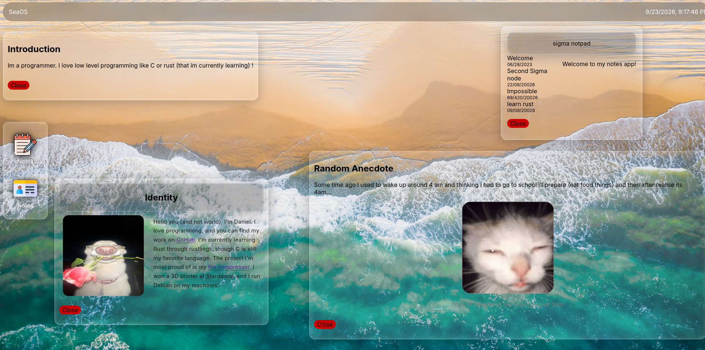

# webos
this is my own webOS called seaOS at first i wasn't really having fun but at the end i really started to enjoy it, and finished it in one day, if you dont like what you do you wont be doing it right, thats what i learned from this!



# How to run locally
1. Clone the repo
```bash
    git clone https://github.com/danielbarseghian/webos.git
```

2. Run the website
Go to the root of the folder and run
### Linux / macOS

```bash
python3 -m http.server
```

### Windows

```bash
python -m http.server
```

make sur you have python installed

# License
Using MIT license

# Credits
<a href="https://www.flaticon.com/free-icons/identity" title="identity icons">Identity icons created by Magnific - Flaticon</a> <br>
<a href="https://www.flaticon.com/free-icons/notepad" title="notepad icons">Notepad icons created by Flat Icons - Flaticon</a>